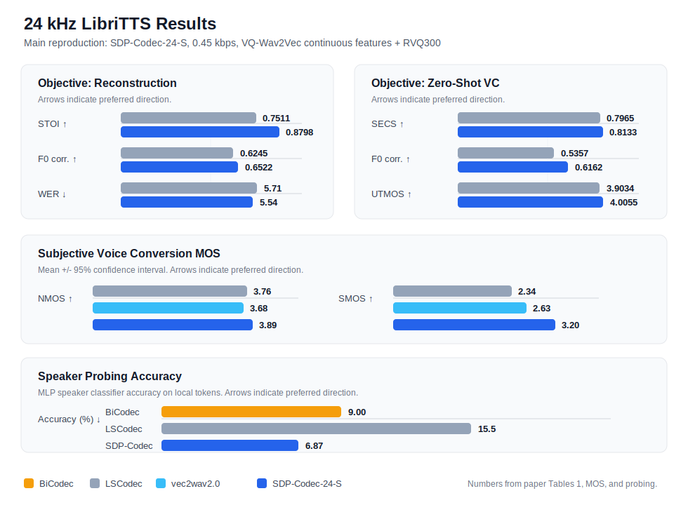
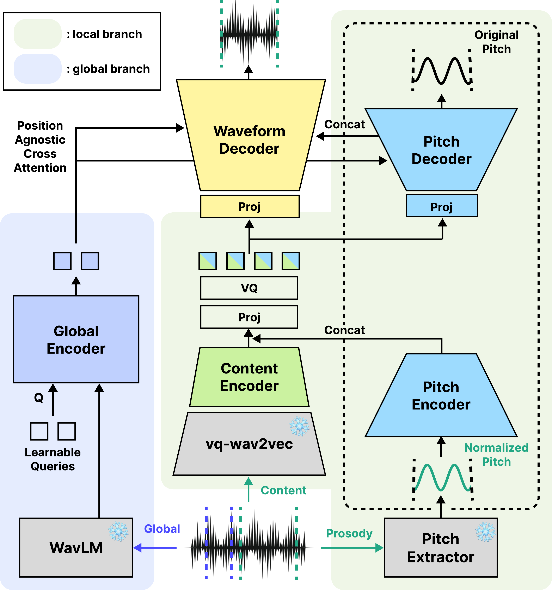

# SDPCodec

[](LICENSE)
[](https://www.python.org/)
[](https://pytorch.org/)
[](https://sdpcodec.github.io/sdpcodec/)

Official implementation of **SDPCodec**, a speech neural codec that jointly
quantizes content and F0 with a single RVQ codebook.

This repository is organized around the main paper reproduction setting:

| Item | Setting |
| --- | --- |
| Config | `configs/sdpcodec_vqw2v_rvq300.yaml` |
| Content encoder | frozen VQ-Wav2Vec continuous features |
| Speaker encoder | frozen WavLM Large |
| Quantizer | RVQ, codebook size 300 |
| Training data | LibriTTS, 24 kHz |
| Segment length | 3.36 s target, 6.0 s reference |

Demo page: https://sdpcodec.github.io/sdpcodec/

## Results At A Glance



The figure summarizes objective metrics, subjective MOS, and speaker-probing
accuracy from the paper's 24 kHz LibriTTS setting.

## Model Architecture



Architecture diagram: [PDF](figs/SDPCodec_Model_Architecture_2606161322.pdf).

## Quick Start

Install the package from the repository root:

```bash
git clone https://github.com/hanshounsu/sdpcodec-open.git
cd sdpcodec-open
git submodule update --init --recursive
python -m pip install -U pip
python -m pip install -r requirements.txt
python -m pip install -r requirements-vqw2v.txt
python -m pip install -e .
```

Prepare the large pretrained weights:

| Asset | Expected path |
| --- | --- |
| WavLM Large | `pretrained_models/wavlm/WavLM-Large.pt` |
| VQ-Wav2Vec k-means | `pretrained_models/vq_wav2vec/vq-wav2vec_kmeans.pt` |

Detailed download and cache instructions are in
[docs/pretrained_assets.md](docs/pretrained_assets.md).

Run a single-GPU smoke test:

```bash
python -m sdpcodec.train \
  train.wandb_enabled=false \
  train.trainer.devices=1 \
  train.trainer.max_steps=10 \
  train.trainer.num_sanity_val_steps=0
```

Run training with the main reproduction config:

```bash
python -m sdpcodec.train
```

Resume from a checkpoint:

```bash
python -m sdpcodec.train ckpt=/path/to/last.ckpt
```

## Inference

Reconstruct one waveform:

```bash
python -m sdpcodec.infer \
  --checkpoint /path/to/checkpoint.ckpt \
  --source examples/source.wav \
  --output outputs/infer/source_rec.wav
```

Voice conversion with a reference speaker:

```bash
python -m sdpcodec.infer \
  --checkpoint /path/to/checkpoint.ckpt \
  --source examples/source.wav \
  --reference examples/reference.wav \
  --mode vc \
  --output outputs/infer/source_to_reference.wav
```

Dataset-level inference:

```bash
python -m sdpcodec.test \
  ckpt=/path/to/checkpoint.ckpt \
  train.trainer.devices=1 \
  voice_conversion=same
```

Use `voice_conversion=vc` for paired-reference voice conversion.

## Main Reproduction

The main config is derived from the 24 kHz VQ-Wav2Vec experiment used for the
paper's SDP-Codec-24-S / TriXCodec-24-S result. In the original internal
`bigcodec` tree, this corresponds to the `vqw2v_enc_24kHz_trixbase` run used in
the table extraction scripts:

```text
2026-01-15-05-28-22-step=635626.5625-stoi=0.8790-min_ref_seconds_0.0
```

Original table labels:

- `TriXCodec-24-S-recon`
- `TriXCodec-24-S-VC`
- `TriXCodec 3.36 cent vqw2v`

Key config values:

```yaml
preprocess:
  audio:
    sr: 24000
dataset:
  name: libritts
  min_audio_length: 80640
  ref_segment_duration: 6.0
model:
  codec_encoder:
    use_vqw2v_continuous: true
  codec_decoder:
    quantizer_type: rvq
    codebook_size: 300
```

## Dataset Notes

The main reproduction uses LibriTTS through Hugging Face Datasets. On shared
machines, set a persistent cache:

```bash
export HF_HOME=/path/to/huggingface-cache
export HF_DATASETS_CACHE=/path/to/huggingface-cache/datasets
```

This public release documents the LibriTTS reproduction path only. Legacy
dataset loaders may remain in the code for internal compatibility, but they are
not part of the supported open baseline.

## Acknowledgements

This implementation was developed with reference to several open speech codec
and voice conversion projects:

- [BigCodec](https://github.com/Aria-K-Alethia/BigCodec), for low-bitrate
  neural speech codec design patterns and training structure.
- [Spark-TTS](https://github.com/SparkAudio/Spark-TTS), including its BiCodec
  formulation and single-stream speech-token decomposition ideas.
- [vec2wav 2.0](https://github.com/cantabile-kwok/vec2wav2.0), for prompted
  vocoding and WavLM-based speaker conditioning ideas.

Third-party components used directly in this repository retain their own
licenses and attributions, including FCPE, WavLM, VQ-Wav2Vec, alias-free-torch,
and Snake activation code.

## Repository Layout

```text
configs/                  Hydra configs
sdpcodec/                 train, inference, and test entrypoints
ptl/                      PyTorch Lightning modules and dataloaders
vq/                       codec encoder, decoder, RVQ, and SSL wrappers
module/                   discriminators
criterions/               losses
pretrained_models/        small bundled assets and placeholders for large weights
docs/pretrained_assets.md pretrained checkpoint setup guide
```

The code is intended to run from the repository root. It does not require a
separate BigCodec checkout or a fixed local path.

## License

This project is released under the [Apache License 2.0](LICENSE).
